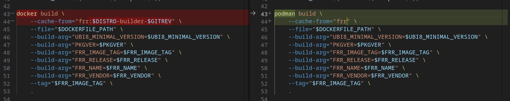
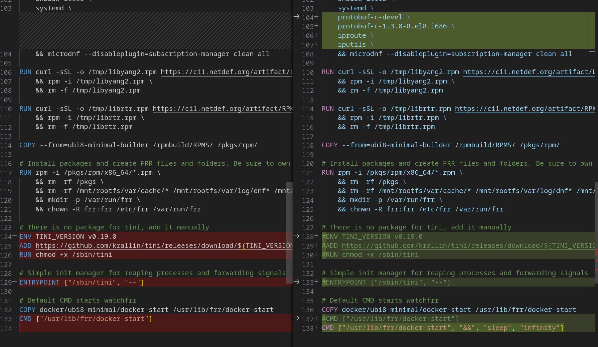

#############################################################################
DISCLAIMER: THESE ARE UNSUPPORTED COMMUNITY TOOLS.

THE REFERENCES ARE PROVIDED "AS IS", WITHOUT WARRANTY OF ANY KIND, EXPRESS OR
IMPLIED, INCLUDING BUT NOT LIMITED TO THE WARRANTIES OF MERCHANTABILITY,
FITNESS FOR A PARTICULAR PURPOSE AND NONINFRINGEMENT.
#############################################################################

A simple image set-up to run FRR on OpenShift based on the work from the FRRouting Git (https://github.com/FRRouting/frr) with some minor changes documented here.

 

Clone: **https://github.com/FRRouting/frr**

Branch: **stable/9.1**

Image: **quay.io/nsatsia/frr-ubi8-v1:v9.1-30f4de3dd0**

Changes made to files in **docker/ubi8-minimal/** directory:

**build.sh changes:**

**Dockerfile changes:**

